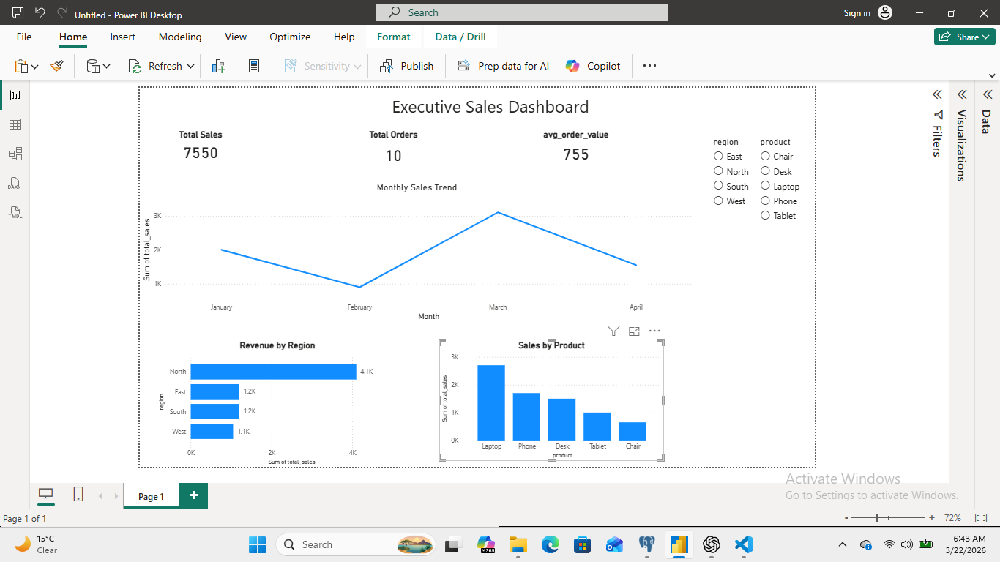

# Sales Performance Dashboard

## 📊 Project Overview

This project analyzes sales performance using SQL and Power BI.
The goal was to identify trends, top-performing regions, and product contributions.

---

## 🛠 Tools Used

* SQL (PostgreSQL)
* Power BI
* Excel (optional)

---

## 📈 Key Insights

* North region generates the highest revenue
* Laptop is the top-selling product
* Sales dropped in February and peaked in March
* Lower-performing regions may need targeted strategies

---

## 📊 Dashboard Features

* KPI Cards (Total Sales, Orders, Avg Order Value)
* Monthly Sales Trend (Line Chart)
* Revenue by Region (Bar Chart)
* Sales by Product (Bar Chart)
* Interactive Filters (Region & Product slicers)

---

## 📸 Dashboard Preview

---

## 💡 Business Recommendations

* Focus marketing efforts on high-performing regions (North)
* Increase stock for top products (Laptop)
* Investigate February sales drop
* Apply successful strategies to underperforming regions
